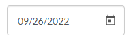
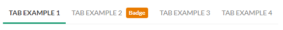

# My Calix Store Quote Manager Inventory

A visual inventory of React components used inside the Quote Manager application in the My Calix Store.

Any UI not detailed as a sub component is considered part of its parent UI.

**Table of Contents**  
[General Components](#general-components)  
[Account Search Page _(/account-search)_](#account-search-page-account-search)  
[Quote List Page _(/quote-list)_](#quote-list-page-quote-list)  
[Search Page _(/search)_](#search-page-search)  
[Cart Page _(/cart)_](#cart-page-cart)  
[Warranty Page _(/checkout/warranty)_](#warranty-page-checkoutwarranty)  
[Shipping Page _(/checkout/shipping)_](#shipping-page-checkoutshipping)  
[Billing Page _(/checkout/billing)_](#billing-page-checkoutbilling)  
[Order Review Page _(/checkout/review)_](#order-review-page-checkoutreview)

# General Components

Components used in multiple places throughout the My Calix Store. These components are avaliable for use through Design System.

## Form Components

- [Button _(in Design System)_](#button)
- [Button Rounded _(in Design System)_](#button-rounded)
- [Button Slim _(in Design System)_](#button-slim)
- [Date Input _(in Design System)_](#date-input)
- [Dropdown Primary _(in Design System)_](#dropdown-primary)
- [Dropdown Secondary _(in Design System)_](#dropdown-secondary)
- [Input Icon _(in Design System)_](#input-icon)
- [Input _(in Design System)_](#input)

## Loader Components

- [Overlay _(in Design System)_](#overlay)
- [Spinner _(in Design System)_](#spinner)

## Others

- [Account Block _(in Design System)_](#account-block)
- [Breadcrumb _(in Design System)_](#breadcrumb)
- [Feedback _(in Design System)_](#feedback)
- [Modal _(in Design System)_](#modal)
- [Notification _(in Design System)_](#notification)
- [Tabs _(in Design System)_](#tabs)
- [Header _(in Design System)_](#header)
- [Footer _(in Design System)_](#footer)
- [Menu _(in Design System)_](#menu)
- [Representative Menu _(in Design System)_](#representative-menu)
- [Checkout Breadcrumb _(in code review)_](#checkout-breadcrumb)
- [Checkout Navigation _(in code review)_](#checkout-navigation)

## Button

Status: **in Design System**

## Button Rounded

Status: **in Design System**

## Button Slim

Status: **in Design System**

## Date Input

Status: **in Design System**

## Dropdown Primary

Status: **in Design System**

## Dropdown Secondary

Status: **in Design System**

## Input

Status: **in Design System**

## Input Icon

Status: **in Design System**

## Overlay

Status: **in Design System**

## Spinner

Status: **in Design System**

## Account Block

Status: **in Design System**

## Breadcrumb

Status: **in Design System**

## Feedback

Status: **in Design System**

## Modal

Status: **in Design System**

## Notification

Status: **in Design System**

## Tabs

Status: **in Design System**

## Header

Status: **in Design System**

### Sub-Components

1. [Menu](#menu) (**in Design System**)
1. [Representative Menu](#representative-menu) (**in Design System**)

## Footer

Status: **in Design System**

## Menu

Status: **in Design System**

## Representative Menu

Status: **in Design System**

## Checkout Breadcrumb

Status: **in code review**

## Checkout Navigation

Status: **in code review**

### Sub-Components

1. [Button Rounded](#button-rounded) (**in Design System**)

# Account Search Page (/account-search)

Status in React Quote Manager: **Built**

# Quote List Page (/quote-list)

Status in React Quote Manager: **Built**

Components used in Quote List page of Quote Manager on the My Calix Store.

- [Quote List Options _(in React Quote Manager)_](#quote-list-options)
- [Quote List Summary _(in React Quote Manager)_](#quote-list-summary)

## Quote List Options

Status: **in React Quote Manager**

### Sub-Components

1. [Button Rounded](#button-rounded) (**in Design System**)

2. [Input](#input) (**in Design System**)

3. [Dropdown Primary](#dropdown-primary) (**in Design System**)

4. [Tabs](#tabs) (**in Design System**)

## Quote List Summary

Status: **in React Quote Manager**

# Search Page (/search)

Status in React Quote Manager **Built except for Quote Block**

Components used in Search page of Quote Manager on the My Calix Store.

- [Quote Block _(in code review)_](#quote-block)
- [Part List Search _(in React Quote Manager)_](#part-list-search)
- [Part List Item _(in React Quote Manager)_](#part-list-item)
- [Part List Filter _(in React Quote Manager)_](#part-list-filter)

## Quote Block

Status: **in code review**

## Part List Search

Status: **in React Quote Manager**

## Part List Item

Status: **in React Quote Manager**

## Part List Filter

Status: **in React Quote Manager**

# Cart Page (/cart)

Status in React Quote Manager: **Not Built**

Components used in Quote List page of Quote Manager on the My Calix Store.

- [Quote Detail Block _(in progress)_](#quote-detail-block)
- [Quote Detail Options _(in code review)_](#quote-detail-options)
- [Quote Detail Item Review _(in code review)_](#quote-detail-options)

## Quote Detail Block

Status: **in progress**

### Sub-Components

1. Quote Block (**in code review**)
2. Tag (**in progress**)

## Quote Detail Options

Status: **in code review**

## Quote Detail Item Review

Status: **in code review**

### Sub-Components

1. Row **in code review**
2. Part Adder **in code review**

# Warranty Page (/checkout/warranty)

Status in React Quote Manager: **Not Built**

Components used in Checkout Warranty page of Quote Manager on the My Calix Store.

- [Warranty Form _(in code review)_](#warranty-form)

## Warranty Form

Status: **in code review**

# Shipping Page (/checkout/shipping)

Status in React Quote Manager: **Not Built**

Components used in Checkout Shipping page of Quote Manager on the My Calix Store.

- [Shipment Address Form _(in code review)_](#shipment-address-form)
- [Multiple Shipment Scheduler _(in Design System)_](#multiple-shipment-scheduler)
- [Shipping Contact Info Form _(in code review)_](#shipping-contact-info-form)

## Shipment Address Form

Status: **in code review**

### Sub-Components

1. [Dropdown Secondary](#dropdown-secondary) (**in Design System**)
2. [Input](#input) (**in Design System**)
3. [Button Rounded](#button-rounded) (**in Design System**)

## Multiple Shipment Scheduler

Status: **in Design System**

### Sub-Components

1. [Date Input](#date-input) (**in Design System**)
2. Item Row (**in code review**)
3. Button with Icon (**in code review**)

## Shipping Contact Info Form

Status: **in code review**

### Sub-Components

1. [Input](#input) (**in Design System**)
2. [Dropdown Primary](#dropdown-primary) (**in Design System**)

# Billing Page (/checkout/billing)

Status in React Quote Manager: **Not Built**

Components used in Checkout Billing page of Quote Manager on the My Calix Store.

- [Billing Address Form _(in code review)_](#billing-address-form)
- [Purchase Order Info Form _(in code review)_](#purchase-order-info-form)

## Billing Address Form

Status: **in code review**

### Sub-Components

1. [Dropdown Secondary](#dropdown-secondary) (**in Design System**)
2. [Dropdown Primary](#dropdown-primary) (**in Design System**)

## Purchase Order Info Form

Status: **in code review**

### Sub-Components

1. [Input](#input) (**in Design System**)

# Order Review Page (/checkout/review)

Status in React Quote Manager: **Not Built**

Components used in Checkout Order Review page of Quote Manager on the My Calix Store.

- [Checkout Item Table _(in code review)_](#checkout-item-table)
- [Checkout Review Info Bloc _(in code review)_](#checkout-review-info-block)
- [Order Recipients Form _(in code review)_](#order-recipients-form)

## Checkout Review Info Block

Status: **in code review**

## Checkout Item Table

Status: **in code review**

### Sub-Components

1. Item Row (**in code review**)

## Order Recipients Form

Status: **in code review**

### Sub-Components

1. [Input](#input) (**in Design System**)
2. [Button Rounded](#button-rounded) (**in Design System**)

<!-- check all pages are present
add account page
proofread
put on confluence -->
